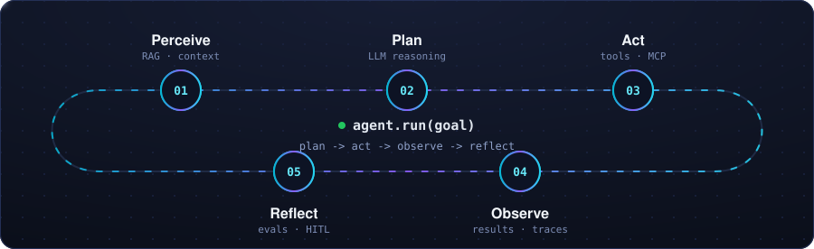
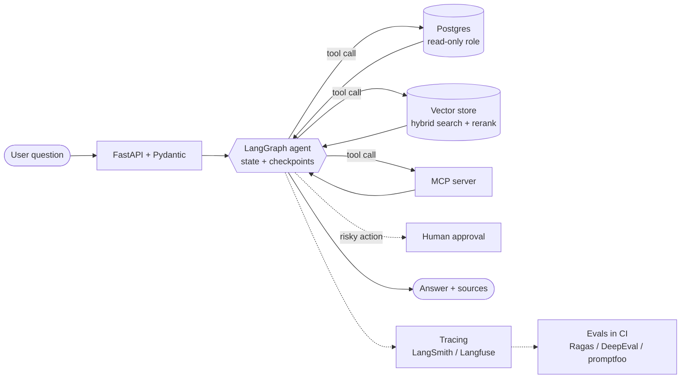
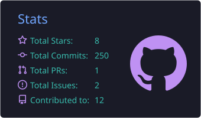
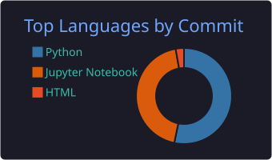

<!-- ═══════════════ HEADER ═══════════════ -->
<div align="center">


<a href="https://github.com/jadhavS04">
  
</a>

<br/>


<br/><br/>

<a href="https://www.linkedin.com/in/shubham-jadhav-501a78286"></a>
<a href="mailto:shubhamvj04@gmail.com"></a>
<a href="https://medium.com/@shubhamjadhav04"></a>
<a href="https://www.kaggle.com/ShubhamJadhav2304"></a>
<a href="https://twitter.com/ShubhamJ2933"></a>

<br/><br/>

<!-- Custom animated SVG: keep the file at assets/agent-loop.svg in this repo -->


</div>

<!-- ═══════════════ ABOUT ═══════════════ -->
## 🧠 `agent.profile`

```python
class ShubhamJadhav:
    role       = "Agentic AI / Data Engineer (fresher)"
    education  = "B.Tech, AI & Data Science (2026)"
    location   = "Maharashtra, India · open to relocation"
    building   = ["LangGraph data-analyst agent", "RAG with hybrid search", "an MCP server"]
    edge       = "data + agents: text-to-SQL, PySpark feeding RAG, Databricks"
    principles = ["least-privilege tools", "evals before vibes", "trace everything"]

    def run(self, goal: str) -> str:
        """plan -> act -> observe -> reflect, until the goal is met."""
```

Most agent builders are strong on prompts and weak on data. I come from the data side (pipelines, SQL, PySpark, Databricks) and build agents that can safely **query, retrieve and reason over real data**, with the evals and tracing to prove they work.

<!-- ═══════════════ NOW ═══════════════ -->
## ⚡ Now

| | |
|---|---|
| 🔨 **Building** | A LangGraph data-analyst agent: upload a CSV, ask in plain English, get tool-driven analysis and charts |
| 📚 **Learning** | Production RAG (hybrid search, reranking, retrieval metrics), MCP servers, LangGraph checkpoints and human-in-the-loop |
| 🎯 **Looking for** | Entry-level roles in AI agents / GenAI engineering and data engineering |

<!-- ═══════════════ STACK ═══════════════ -->
## 🛠️ Agent Engineering Stack

| Layer | What I work with |
|---|---|
| **Core engineering** |        <br/> `async Python` |
| **LLM apps** |  `structured outputs` `tool calling` `streaming` `prompt caching` `token-cost tracking` `model selection` |
| **RAG** |   <br/> `chunking` `hybrid keyword + vector search` `reranking` `metadata filters` `retrieval metrics` |
| **Agents** |   <br/> `tool-use loop` `workflow vs agent` `state + checkpoints` `human-in-the-loop` `SDK-native agents` |
| **Reliability** |      <br/> `eval sets + regression tests in CI` `tracing` `prompt-injection basics` `least-privilege tools (read-only DB users)` |
| **Data + agents** |    <br/> `text-to-SQL over real schemas` `PySpark ingestion into RAG` `Vector Search` `Model Serving` `Unity Catalog` |
| **Applied ML & CV** |    `YOLO` `scikit-learn` |

<details>
<summary><b>🧩 How I structure a data agent (click to expand)</b></summary>

<br/>



</details>

<!-- ═══════════════ PROJECTS ═══════════════ -->
## 🚀 Featured Projects

<table>
  <tr>
    <td width="50%" valign="top">
      <h4>🌍 <a href="https://github.com/jadhavS04/geopower-index">GeoPower Index</a></h4>
      Full-stack military power ranking built on real SIPRI data. Databricks medallion pipeline (Bronze → Silver → Gold) served by FastAPI and rendered in React.<br/>
      <sub><b>Next:</b> an LLM report generator and a chatbot over the site's own data.</sub><br/><br/>
      
      
      
    </td>
    <td width="50%" valign="top">
      <h4>🤖 Data Analyst Agent <sup>· in progress</sup></h4>
      Upload a CSV and ask questions in plain English. A LangGraph agent plans its steps, calls analysis tools (stats, outliers, correlations, charts), recovers from tool errors and writes up the insights.<br/><br/>
      
      
      
      
    </td>
  </tr>
  <tr>
    <td width="50%" valign="top">
      <h4>📊 IPL Analytics ETL Pipeline</h4>
      End-to-end ETL that cleans and models IPL match data for analysis and dashboards.<br/><br/>
      
      
      
      
    </td>
    <td width="50%" valign="top">
      <h4>🚗 ANPR System</h4>
      Automatic number-plate recognition: YOLOv11x for plate detection, EasyOCR for reading, Arduino for the IoT side.<br/><br/>
      
      
      
    </td>
  </tr>
  <tr>
    <td width="50%" valign="top">
      <h4>💰 Retail Price Optimization</h4>
      Random Forest pricing model built during an internship, reaching <b>R² = 0.967</b>.<br/><br/>
      
      
    </td>
    <td width="50%" valign="top">
      <h4>🗺️ Up next</h4>
      RAG support chatbot with hybrid search · multi-agent market-research crew · PDF Q&amp;A agent with intent routing (vector vs SQL) · a custom MCP server.<br/><br/>
      
    </td>
  </tr>
</table>

<!-- ═══════════════ ANALYTICS ═══════════════ -->
## 📈 GitHub Analytics

<div align="center">




<br/>


<br/><br/>


</div>
<!-- ═══════════════ CONNECT ═══════════════ -->
## 🤝 Let's Connect

I'm looking for **fresher / entry-level roles** in AI agents, GenAI engineering and data engineering. Pune is my first choice, and I'm open to other major Indian cities. If you're building agents that touch real data, I'd love to talk.

<div align="center">


</div>
